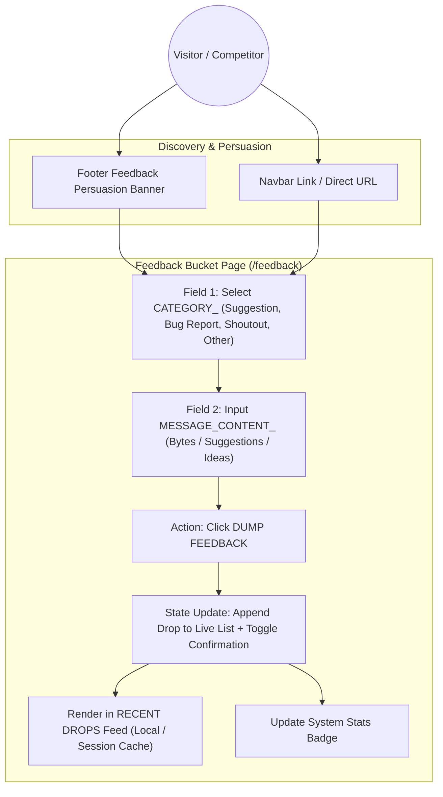

# Data Flow (PUA ICPC / Feedback Bucket)

> Generated by Graphify on 2026-09-27. Last updated: 2026-09-27.

## Diagram

## Analysis Notes

- **Sources:** Visitor input (Category selection, message textarea).
- **Mutations:** In-memory drop pipeline adding immediate visual confirmation and instant card rendering in "Recent Drops".
- **Sinks:** Live client UI feedback feed, potential future API endpoint hook (`/api/feedback`).
