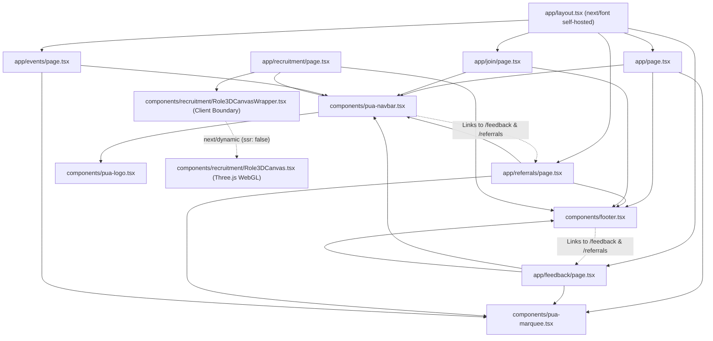

# Component Dependency Graph (PUA ICPC)

> Generated by Graphify on 2026-09-27. Last updated: 2026-09-27.

## Diagram

## Analysis Notes

- **Hub nodes:** `components/pua-navbar.tsx` and `components/footer.tsx` are top hubs consumed across all primary routes.
- **Dynamic Decoupling:** `Role3DCanvas` (546 KB Three.js) is decoupled from the server component route `/recruitment` via `Role3DCanvasWrapper` and `next/dynamic({ ssr: false })`.
- **Typography:** Self-hosted `next/font/google` in `app/layout.tsx` eliminates external render-blocking font requests.
- **Orphans:** None.
- **Circular dependencies:** None. Route links are clean string hrefs.
