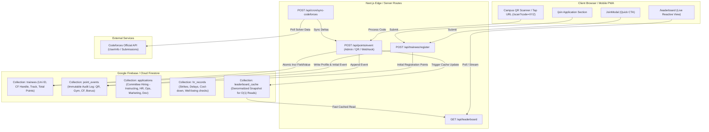

# Graphify Gate Report: Firebase Architecture & Event-Driven Leaderboard

**Date:** 2026-10-06  
**Status:** CLEARED  
**Target Subsystems:**
1. Trainee Registration Engine (`/join`, `JoinModal`, `/api/trainees/register`)
2. Event-Driven Extensible Leaderboard (`/leaderboard`, `/api/leaderboard`, `/api/points/event`)
3. Multi-Committee Role Schema & HR Audit Logs (`trainees`, `applications`, `point_events`, `hr_records`)
4. Firebase & Firestore Data Access Layer (`lib/firebase.ts`, `lib/firebase-admin.ts`)

---

## 1. System Topology & Data Flow



---

## 2. Firestore Collections Schema Definition

### A. `trainees` (Collection)
Primary identifier: `id` (Auto-generated UID or sanitized University ID).
```typescript
interface TraineeDocument {
  id: string;
  fullName: string;
  universityId: string;       // e.g. "202301982" - indexed & unique
  email: string;
  phone: string;              // WhatsApp contact
  academicYear: "Year 1" | "Year 2" | "Year 3" | "Year 4";
  track: "level_1" | "level_2"; // Level 1 (Fundamentals) vs Level 2 (Advanced)
  codeforcesHandle: string;   // sanitized handle (without @)
  status: "active" | "probation" | "graduated" | "inactive";
  
  // Aggregate Metrics (Maintained via Atomic Transactions / FieldValue.increment)
  pointsTotal: number;
  cfRating: number;
  cfSolvedCount: number;
  attendedSessionsCount: number;
  qrScansCount: number;
  
  // Timestamps
  registeredAt: FirebaseFirestore.Timestamp;
  updatedAt: FirebaseFirestore.Timestamp;
}
```

### B. `point_events` (Collection - Immutable Ledger)
Tracks every single point mutation, ensuring mathematical traceability and prevention of double-scanning.
```typescript
interface PointEventDocument {
  id: string;
  traineeId: string;
  universityId: string;
  type: "qr_scan" | "session_attendance" | "cf_sync" | "coach_bonus" | "upsolve" | "penalty";
  points: number;             // can be positive or negative
  reason: string;             // e.g. "Campus Booth QR Code A1", "Session 2 STL Upsolve"
  metadata?: {
    qrCodeId?: string;        // prevents duplicate scan for single-use or daily QR
    sessionId?: string;
    coachId?: string;
    cfContestId?: number;
  };
  createdAt: FirebaseFirestore.Timestamp;
}
```

### C. `applications` (Collection - Future Committee Hiring)
Directly mapped to the Leadership Directory Handbook for 5 committees.
```typescript
interface ApplicationDocument {
  id: string;
  traineeId?: string;
  fullName: string;
  universityId: string;
  email: string;
  phone: string;
  committee: "executive" | "instructing" | "hr_monitoring" | "ops_pr" | "marketing" | "design_dev";
  roleApplied: string;        // e.g. "Level 1 Instructor", "PR Logistics Coordinator"
  cvOrPortfolioUrl?: string;
  answers: Record<string, string>;
  status: "applied" | "screening" | "interviewed" | "accepted" | "rejected" | "pool";
  createdAt: FirebaseFirestore.Timestamp;
  updatedAt: FirebaseFirestore.Timestamp;
}
```

### D. `hr_records` (Collection - HR Monitoring & Strict Zero Martyrdom)
Directly implementing the Universal Rules of the ICPC PUA Handbook.
```typescript
interface HRRecordDocument {
  id: string;
  targetMemberId: string;     // Reference to committee member or applicant
  committee: string;
  recordType: "strike" | "delay_notice" | "cooldown_24h" | "burnout_check" | "commendation";
  details: string;
  issuedByHrId: string;
  status: "active" | "resolved" | "appealed";
  validUntil?: FirebaseFirestore.Timestamp;
  createdAt: FirebaseFirestore.Timestamp;
}
```

---

## 3. Atomic Execution Plan

1. **Firebase Dependencies & Configuration:**
   - Install `firebase` and `firebase-admin`.
   - Setup client configuration (`lib/firebase.ts`) and server-side admin initialization with graceful fallback (`lib/firebase-admin.ts`).
2. **Backend API Endpoints:**
   - `POST /api/trainees/register`: Lean registration validation, duplicate ID check, initial welcome point allocation event.
   - `POST /api/points/event`: Scalable event-driven point router (supports QR scans, session attendance, manual coach increments).
   - `GET /api/leaderboard`: High performance cached leaderboard endpoint serving real trainee ranks.
3. **Frontend UI Transformation:**
   - Update `JoinModal` & `app/join/components/application-section.tsx` with the lean fields (Full Name, Uni ID, Email, Phone/WhatsApp, Academic Year, Track, CF Handle).
   - Wire registration form to `/api/trainees/register` with instant reactive feedback and error states.
   - Upgrade `app/leaderboard/page.tsx` to consume the real Firebase leaderboard endpoint with live filter by track (All, Level 1, Level 2) and fallback gracefully if offline.
