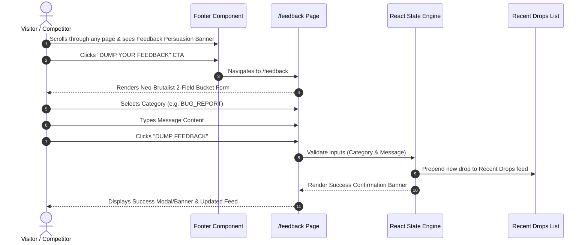

# Sequence Flows (PUA ICPC / Feedback Bucket Discovery & Dump)

> Generated by Graphify on 2026-09-27. Last updated: 2026-09-27.

## Diagram

## Analysis Notes

- **Actors:** Visitor, Footer Component, Feedback Page, React State Engine, Recent Drops List.
- **Key Flow:** Seamless transition from Footer callout to 2-field form submission.
