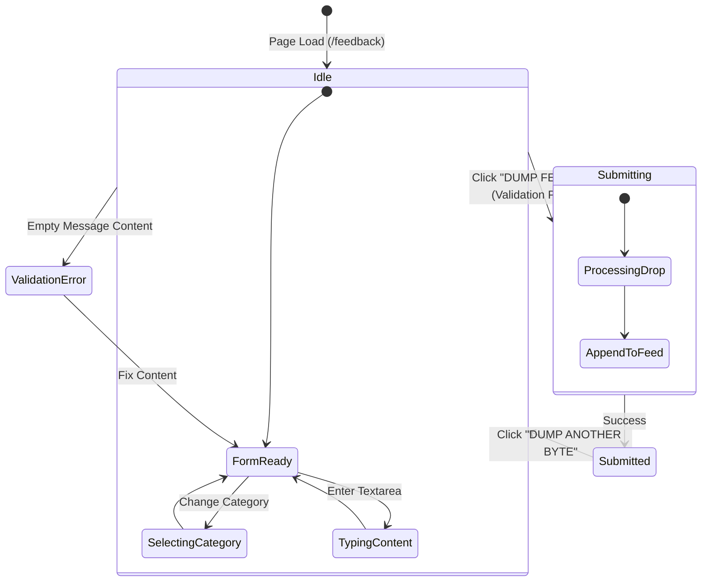

# State Machines (PUA ICPC / Feedback Bucket)

> Generated by Graphify on 2026-09-27. Last updated: 2026-09-27.

## Diagram

## Analysis Notes

- **Transitions:** FormReady -> Submitting -> Submitted.
- **Error handling:** Empty textarea blocks submission gracefully and alerts user to input bytes.
- **Recovery:** User can reset state and submit multiple drops in one session.
