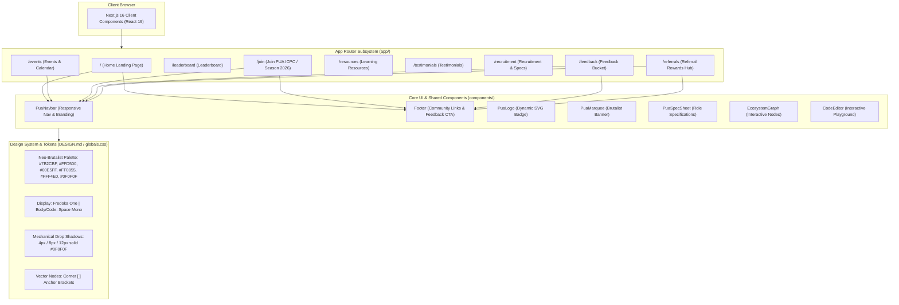

# System Topology (PUA ICPC / Code Strike)

> Generated by Graphify on 2026-09-27. Last updated: 2026-09-27.

## Diagram

## Analysis Notes

- **Critical paths:** `PuaNavbar` and `Footer` serve as global site anchors. Adding the Feedback Bucket CTA in `Footer` connects all pages directly to `/feedback`.
- **Subsystems:** App Router pages, Shared UI Component Library, and Neo-brutalist Design Token Engine.
- **Risk areas:** Ensure Tailwind v4 `@theme` and custom classes (`shadow-neo`, `btn-solid`, `vector-node`) remain consistent across new pages.
